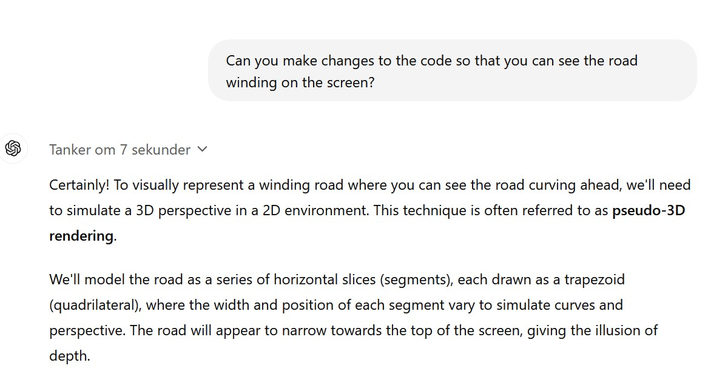

# Car Game
A car game in Python, with help from an LLM... 
 
 
 
So, here we go. We are going to create a car game with the help of an LLM.  
Exciting.
<h2>Exercise 1.</h2>
So, we begin chatting with ChatGPT (version ChatGPT o1-preview. October 2024). 

 
Interestingly, and a little surprisingly, this worked <i><b>fine</b></i> right out of the box. 
 
Running the code, it looks like this: 
 
 
Perhaps not the most exciting car game you ever saw, but a good start. 
You can now ask ChatGPT for similar code,  or you can run the code  <a href="Code/CargameInitialVersion.py">Car Game</a> (Initial version). 
 
You can control the car with arrows, and the car does appear to be moving. So, that’s all fine.  
The car is yellow off road, and red on the road. Ok. Fine.  
Still, you can, of course, change everything you are not pleased with, or ask ChatGPT to do it for you.

<h2>Exercise 2.</h2>
In order to make the game more exciting, I will ask for a more winding road.  

