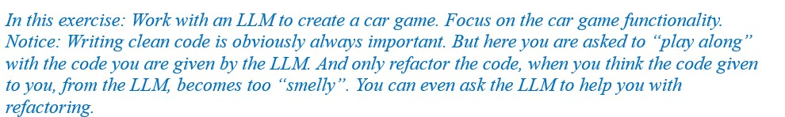
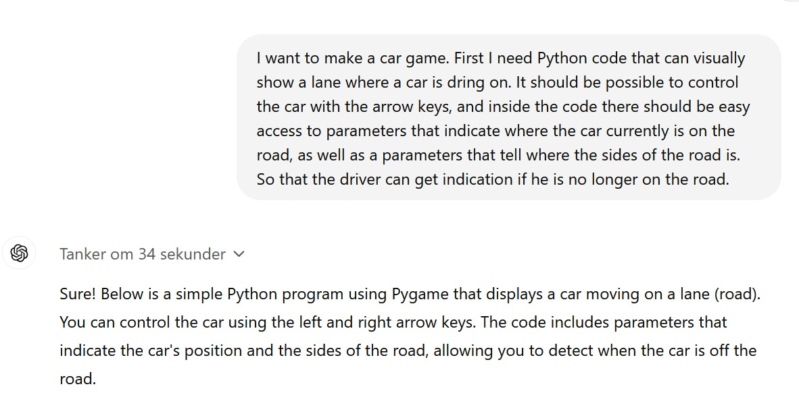
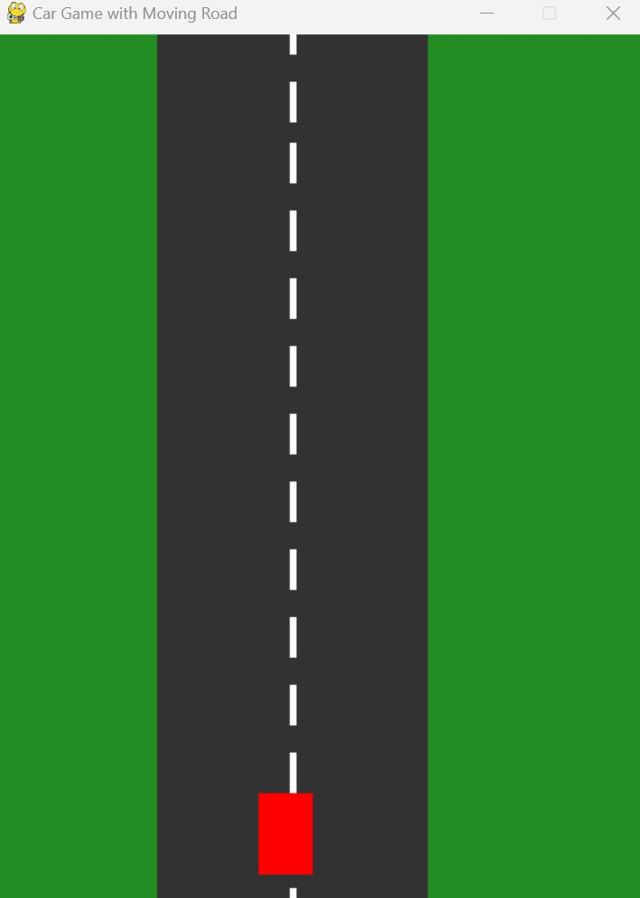
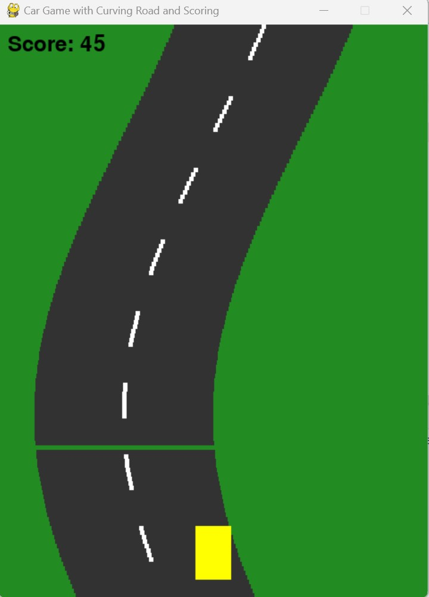
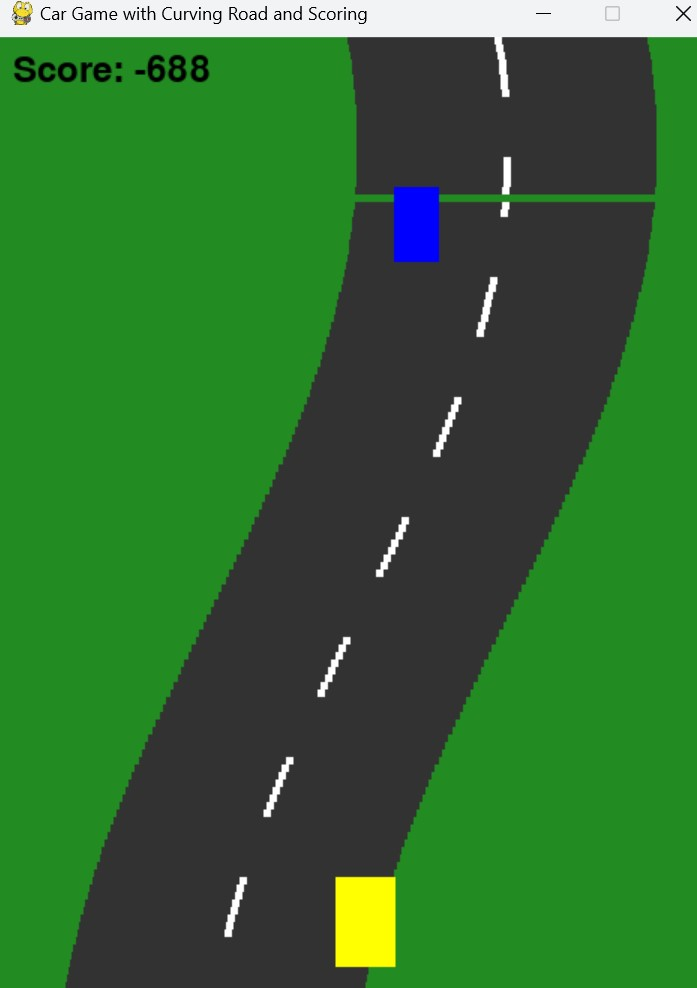
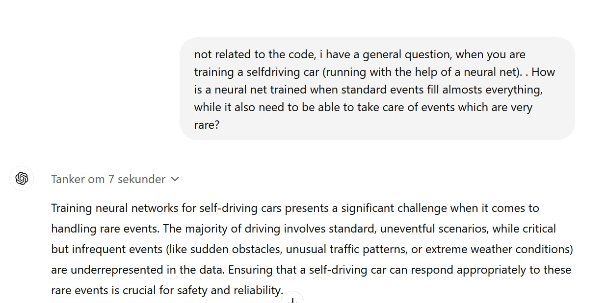
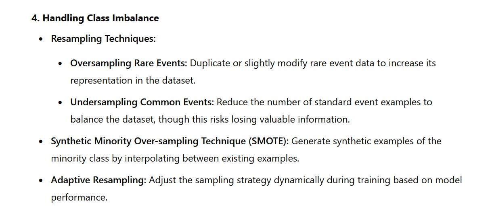

# Car Game
A car game in Python, with help from an LLM...<br>
<br>
<br>
<br>
So, here we go. We are going to create a car game with the help of an LLM. <br>
Exciting.
<h2>Exercise 1.</h2>
So, we begin chatting with ChatGPT (version ChatGPT o1-preview. October 2024).<br>

<br>
Interestingly, and a little surprisingly, this worked <i><b>fine</b></i> right out of the box.<br>
<br>
Running the code, it looks like this:<br>
<br>
<br>
Perhaps not the most exciting car game you ever saw, but a good start.<br>
You can now ask ChatGPT for similar code,<br> or you can run the code  <a href="Code/CargameInitialVersion.py">Car Game</a> (Initial version).<br>
<br>
You can control the car with arrows, and the car does appear to be moving. So, that’s all fine. <br>
The car is yellow off road, and red on the road. Ok. Fine. <br>
Still, you can, of course, change everything you are not pleased with, or ask ChatGPT to do it for you.

<h2>Exercise 2.</h2>
In order to make the game more exciting, I will ask for a more winding road. <br>
< src="Pics/WindingRoadDialogue.jpg" alt="Chat with ChatGPT" width="500"><br>
Ok. That’s actually more than I asked for.<br>
< src="Pics/WindingRoadScreen.jpg" alt="Car game. Chat with ChatGPT" width="200" hspace="100"><br>
Looks good visually. <br>
Inside the code I am already beginning to be nervous though, <br>about the “update road in slices part”,  and how this will play out as we move on with the project. <br>
<br>

```
                # Update road slices
                    for slice_info in road_slices:
                         # Move the slice down the screen
                         slice_info['y'] += scroll_speed

                      # If the slice is off the bottom, reset to the top
                      if slice_info['y'] > HEIGHT:
                          slice_info['y'] -= HEIGHT + slice_height
```

Well. So, if a slice is down below, we change its coordinates? <br>Easy code, probably, but not super, intuitively, easy to understand code. A little “smelly”, Imho.<br> I.e. how will this work out for us as we move on, later, with adding more functionality to the game?  <br>
And all of this talk about a 3D perspective in a 2D environment. Hallucinating? <br>
<br>
Anyway. Nevermind. We will take the code for now. <br>
Try out the code by running the file <a href="Code/CargameWindingRoad.py">Car Game</a> (Winding road). <br>
Or ask ChatGPT for your version of the code.

<h2>Exercise 3.</h2>
So far, so good. But its not a game unless the user receives points for doing well, and no points for not doing so good… <br>
Getting that out of ChatGPT was not so easy… <br>And took several prompts and much explaining...<br>
Looking at the very few changes needed to make that work, <br>you can’t help thinking that it would have been easier just to add the scoring to the code yourself.  <br>
Anyway, the end result of the discussion can be seen in <a href="Code/Cargame.py">Car Game</a> (With points).<br>
<br>
Try out the code. Or make your adjustments to the code to add points to the game. <br>

```
          # Render the score
           score_text = font.render(f"Score: {score}", True, BLACK)
           window.blit(score_text, (10, 10))  # Draw score at top-left corner
```

<h2>Exercise 4.</h2>
Now, we need to add some traffic to the game.
Making a good prompt for that appears to be a tricky thing, though.<br>
Certainly, it was a struggle to run the code that was coming from ChatGPT (by all means, try it yourself).<br>
So, in order to proceed, we might need to do some “<i>chain of thought</i>” (COT) prompting here...?<br>
<br>
First, we need a place to spawn the new cars, at which stage the idea about moving the road in “slices” becomes annoying?<br>
Anyway, we agreed on code like this: <br>

```
# Spawn traffic cars
current_time = pygame.time.get_ticks()
if (current_time - last_spawn_time) > traffic_spawn_interval:
    last_spawn_time = current_time

    # Spawn traffic for slice
    slice_info = road_slices[0]
    # Traffic y coordinate
    traffic_lane_y = slice_info['y']

    # Calculate the curvature offset for this slice
    curve = math.sin((slice_info['y'] + total_distance) * curve_frequency) * curve_amplitude
    # Update the x-coordinate of the slice
    traffic_lane_x = (WIDTH - road_width) // 2 + curve + slice_info['traffic_road_offset']

    # Create traffic car rect
    traffic_rect = pygame.Rect(traffic_lane_x, traffic_lane_y, traffic_width, traffic_height)
```

But that’s, of course, not enough, we also need to add code that checks if our car is running into the traffic.<br>
After some “debate”, we settled on this code:<br>

```
# Check if  traffic collides with car
slice_info = road_slices[0]
# Traffic y coordinate
traffic_lane_y = slice_info['y']
if (abs(car_y - traffic_lane_y) < 20) and (slice_info['DoneCrash'] == False):
    # Calculate the curvature offset for this slice
    curve = math.sin((slice_info['y'] + total_distance) * curve_frequency) * curve_amplitude
    # Update the x-coordinate of the slice
    traffic_lane_x = (WIDTH - road_width) // 2 + curve + slice_info['traffic_road_offset']
    if abs(car_x - traffic_lane_x) < 20:
       # Crash
       slice_info['DoneCrash'] = True
       crash_text = font.render(f"Crash: -1000 Points", True, RED)
       window.blit(crash_text, (10, 50))  # Draw score at top-left corner
       # Update the display
       pygame.draw.rect(window, WHITE, car_rect)
```

A lot of the <b><i>magic</i></b> comes down to understanding which slice is holding the traffic, and where that is compared to our car. <br>That you need to recalculate “curvature offset”, and what have you, for doing that is...well, smelly, imho. <br><br>I.e. this probably needs some refactoring, to make the coding of other, later features easier.<br>
So, well, as in many software teams, the team members were kind of yelling at each other here...<br> Arguing about who was making good clean code, and who was making smelly, confused code. <br>
<br>
It was time for the project manager, that was also me, to step in and say “enough”, we have a deadline to meet, so we will deliver this code, and make room for refactoring in upcoming sprints <br>(<b><i>Notice</i></b>: Shipping error prone code, with the excuse that we are doing refactoring later on… <br>Well, don’t do that IRL…).<br>
<br>
Anyway, the game looked cool:<br>
<br>

The code is available in the file <a href="Code/CargameTraffic.py">Car Game</a> (With traffic). <br>But you can also try (and see if it is possible for you) to make some smart prompts, that will make it possible for you to get the code directly from ChatGPT. 
<h2>Exercise 5.</h2>
<i>Collecting data.</i><br>
<br>
In this day and age, we obviously also want our car to be self-driving. In this simple setting, we could, of course, just code this with a few if-statements. But that wouldn’t be much fun…<br>
We also know that computers can learn to play Atari games like Pong from raw pixel input. So, raw pixel input could probably also work here.  (But) Training that is likely to take some time, and a good graphics card. <br>
<br>
So, here, it is probably better to proceed with the simplest possible input: <br>Where are we (offset from the middle of the road) and where is the traffic (lane 1 or 2). Collect data for that along with the user action. And see if some machine learning algorithm can learn to reproduce (good) user actions. <br>
<br>
Things are still not entirely rosy, though. <br>
Playing the game in its current form, it quickly becomes obvious that a player will do reasonably well by just driving straight ahead. So, an algorithm trained on such data will probably also do reasonably well, by just going straight ahead. Not paying too much attention to every twist and turn of the road, and not being too concerned about traffic passing by very closely. <br>
-	Not what we want. <br>We want the car to be able to self-drive, in such a way that it <i><b>follows the road closely, and not being in the same lane as traffic</b></i>. <br>
<br>
I.e how can we make sure that the self-driving car also deals with “rare” events.  ChatGPT says:
<br>
Yes.<br>
And ChatGPT gets even more to the point later on in its answer:<br>
<br>
So, maybe here it would be possible to train an algorithm on collected data, if we just oversample the rare events<br> (when the user is actually doing something, rather than just going straight ahead). <br>
And, eventually, after a lot of back and forth with ChatGPT, there was even some code for doing that.<br> But, sadly, again, smelly code.<br>
So, on with the thinking cap again: What about making it easier by forcing the driver to make small moves all the time? I.e. not allowing the driver to just go straight? And then “cheating” by collecting those datapoint from another computer program, running the car…? <br>
<br>
Indeed, there are many possibilities when it comes to data collecting.<br>
In the <b><i>first version</i></b> the user is driving the car, and we are collecting road offsets (where is the car compared to the car), and traffic position (which lane).<br>
<br>


