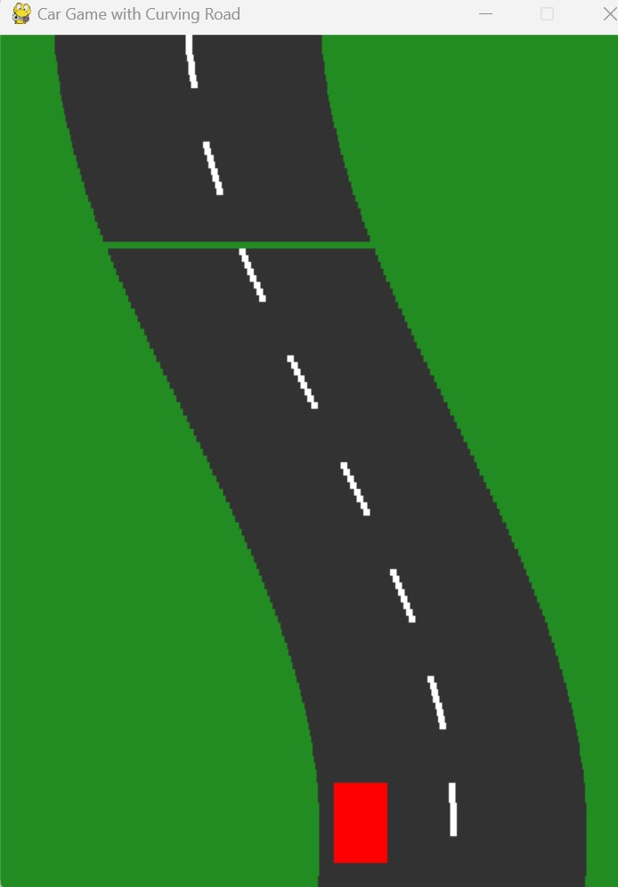

# Car Game
A car game in Python, with help from an LLM...<br>
<br>
<br>
<br>
So, here we go. We are going to create a car game with the help of an LLM. <br>
Exciting.
<h2>Exercise 1.</h2>
So, we begin chatting with ChatGPT (version ChatGPT o1-preview. October 2024).<br>

<br>
Interestingly, and a little surprisingly, this worked <i><b>fine</b></i> right out of the box.<br>
<br>
Running the code, it looks like this:<br>
<br>
<br>
Perhaps not the most exciting car game you ever saw, but a good start.<br>
You can now ask ChatGPT for similar code,<br> or you can run the code  <a href="Code/CargameInitialVersion.py">Car Game</a> (Initial version).<br>
<br>
You can control the car with arrows, and the car does appear to be moving. So, that’s all fine. <br>
The car is yellow off road, and red on the road. Ok. Fine. <br>
Still, you can, of course, change everything you are not pleased with, or ask ChatGPT to do it for you.

<h2>Exercise 2.</h2>
In order to make the game more exciting, I will ask for a more winding road. <br>
<br>
Ok. That’s actually more than I asked for.<br>
<br>
Looks good visually. <br>
Inside the code I am already beginning to be nervous though, <br>about the “update road in slices part”,  and how this will play out as we move on with the project. <br>
<br>

```
                # Update road slices
                    for slice_info in road_slices:
                         # Move the slice down the screen
                         slice_info['y'] += scroll_speed

                      # If the slice is off the bottom, reset to the top
                      if slice_info['y'] > HEIGHT:
                          slice_info['y'] -= HEIGHT + slice_height
```

Well. So, if a slice is down below, we change its coordinates? <br>Easy code, probably, but not super, intuitively, easy to understand code. A little “smelly”, Imho.<br> I.e. how will this work out for us as we move on, later, with adding more functionality to the game?  <br>
And all of this talk about a 3D perspective in a 2D environment. Hallucinating? <br>
<br>
Anyway. Nevermind. We will take the code for now. <br>
Try out the code by running the file <a href="Code/CargameWindingRoad.py">Car Game</a> (Winding road) Or ask ChatGPT for your version of the code.

<h2>Exercise 3.</h2>


